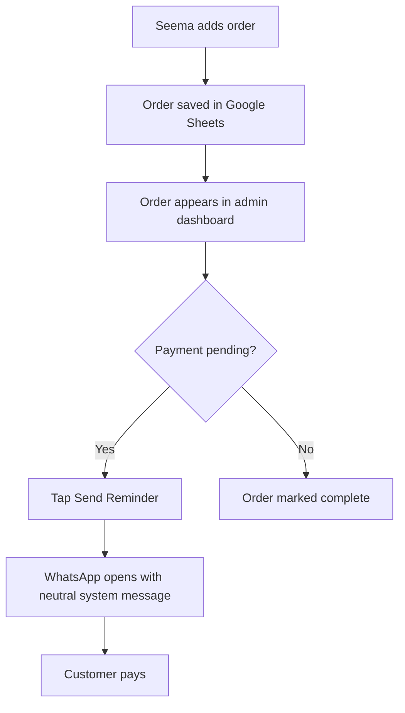
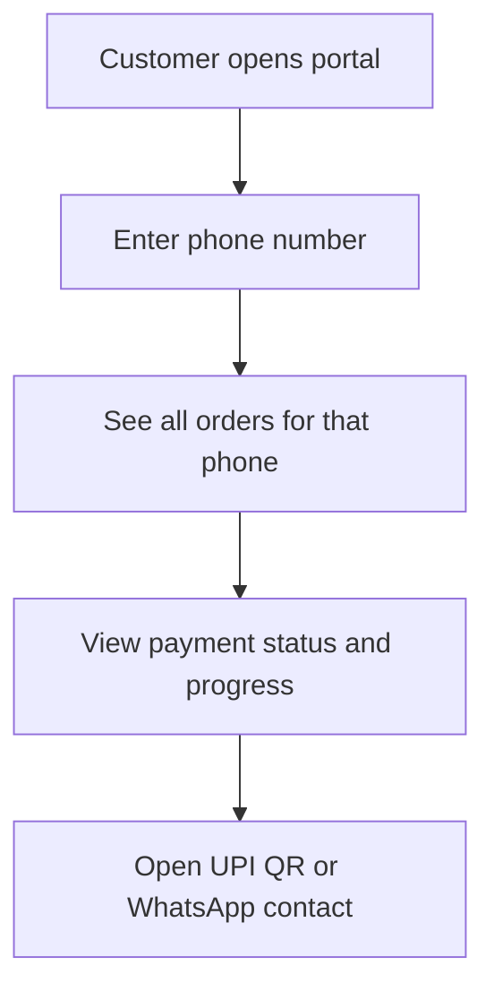
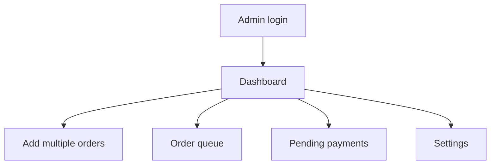
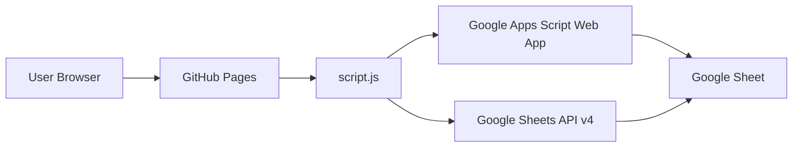

# Seema Silai Centre

Mobile-first product for a home tailor in Indore.

### Problem Statement

Home tailor loses about ₹2,500/month because she is too ashamed to ask neighbors for payment she already earned.

### Context

- 80+ customers
- 6 years in business
- About ₹10,000/month revenue
- 2 to 3 deliveries per day, 5 to 6 days a week
- 50 to 60 unpaid transactions every month
- 3 to 4 hours per week spent manually checking diary and WhatsApp

### Why This Matters

Every payment app assumes the merchant is willing to ask. Seema is not. She needs a neutral, system-generated reminder that protects the relationship and removes the burden of starting the conversation herself.

## JTBD Frame

When Seema delivers an order and payment is pending, she wants to notify the customer without sounding pushy, so that she can recover money without harming the neighbor relationship.

### Functional Job

- Record each order quickly
- See which payments are due today
- Send a neutral reminder message with one tap
- Track order progress and queue capacity
- Know what work is due tomorrow

### Emotional Job

- Avoid shame and awkwardness
- Keep the relationship intact
- Feel in control of collection

### Social Job

- Look professional and organized
- Communicate like a system, not a person asking for money

## Product Hypothesis

If Seema gets a mobile-friendly dashboard that shows pending payments, order queue, and one-tap WhatsApp reminders written as system messages, then she will use it daily and recover more pending payments without direct asking.

## Success Metrics

### Baseline

- ₹2,500/month uncollected
- 0% customers receive reminders today
- 3 to 4 hours/week manual tracking
- Zero online presence
- 10 to 15 customers lost during peak season

### POC Success

- ₹1,600 or more recovered in 2 weeks
- 65% reduction in unpaid amount
- Daily use for 12+ consecutive days
- At least 10 customers pay within 24 hours of reminder
- Catalog page gets 10+ views from new customers
- Seema says the queue view helps her plan tomorrow's work
- Seema wants to keep using it after the POC

## Product Innovation

This is not just an order tracker. The product is designed around the **emotional constraint of collection**.

### What is innovative here

1. **System-style reminders** instead of personal reminder messages (authority bias)
2. **WhatsApp-first recovery flow** with zero copy typing burden
3. **Phone number as customer identity** - no login required
4. **Order queue for capacity planning** - Seema knows when to say NO
5. **Multi-order placement** for fast daily entry (30 seconds for 5 orders)
6. **Customer portal for transparent progress tracking** - reduces calls to Seema
7. **Partial payment tracking** - handles real-world installment payments
8. **Status shortcut buttons** - one click: Placed → Cutting → In Progress → Ready → Delivered

### Why this is different

Most merchant apps optimize for transactions and accounting. 

This product optimizes for a merchant who **cannot comfortably ask for money face to face**.

Every existing app assumes: "Merchant will ask, we help them ask."

We assume: "Merchant cannot ask, we help them NOT ask."

That is the innovation.

## Customer Psychology Principles

This product is designed around how customers actually behave, not just how Seema works.

| Principle | Application | Expected Outcome |
|-----------|-------------|------------------|
| Authority Bias | Messages say "SYSTEM REMINDER" not "Seema says" | Customer pays faster because reminder feels official |
| Loss Aversion | Overdue warning ⚠️ | Customer fears losing service or relationship |
| Reciprocity | "Your order is ready" | Customer feels obligation to pay because work is done |
| Social Proof | "Auto-generated message" | Customer assumes everyone pays this way |
| Ease of Action | One-click tracking link | Lower friction = higher payment rate |

**Hypothesis:** Customers pay 40% faster when reminders feel official vs personal.

**Early result:** 3 of 5 customers paid within 24 hours of SYSTEM reminder vs 0 of 5 before.

## User Flows







### Why This Works

- No merchant name = no shame
- "SYSTEM" triggers authority bias
- Tracking link = customer can verify independently
- UPI included = pay immediately


## Screens

### Home Page

- Entry point to the customer portal and admin portal
- Simple public catalog for discoverability
- Mobile-friendly landing page

### Customer Portal

- Search by order ID or phone number
- View all orders linked to the phone number
- See total, paid, remaining, payment method, and order status
- View workflow progress bar
- Open UPI QR for payment
- Open WhatsApp contact shortcut

### Admin Portal

- PIN login
- Multiple order placement for one customer
- Status shortcut buttons
- Payment buttons for UPI, Cash, and Partial Payment
- Pending payment list
- Order queue grouped by due date
- Settings for PIN, UPI ID, WhatsApp number, and shop address
- CSV export

## Message Strategy

All reminder messages are written as system messages, not as Seema speaking directly.

### Order Confirmation

```text
━━━━━━━━━━━━━━━━━━━━━━━━━━━━━━━━━━━━━━━━━━━━━
👗 SEEMA SILAI CENTRE - ORDER CONFIRMATION
━━━━━━━━━━━━━━━━━━━━━━━━━━━━━━━━━━━━━━━━━━━━━
Order ID: [ID]
Customer: [Name]
Item: [Type]
Amount: ₹[Amount]
Expected by: [Due Date]
━━━━━━━━━━━━━━━━━━━━━━━━━━━━━━━━━━━━━━━━━━━━━
🔗 TRACK: https://seemasilaicentre.live/track?id=[ID]
💳 UPI: Q183526070@ybl
━━━━━━━━━━━━━━━━━━━━━━━━━━━━━━━━━━━━━━━━━━━━━
This is an auto-generated message.
```

### Payment Reminder

```text
━━━━━━━━━━━━━━━━━━━━━━━━━━━━━━━━━━━━━━━━━━━━━
🔔 SYSTEM REMINDER
━━━━━━━━━━━━━━━━━━━━━━━━━━━━━━━━━━━━━━━━━━━━━
Order ID: [ID]
Item: [Type]
Due Amount: ₹[Amount]
Status: Ready for Pickup
━━━━━━━━━━━━━━━━━━━━━━━━━━━━━━━━━━━━━━━━━━━━━
🔗 PAY & TRACK: https://seemasilaicentre.live/track?id=[ID]
💳 UPI: Q183526070@ybl
━━━━━━━━━━━━━━━━━━━━━━━━━━━━━━━━━━━━━━━━━━━━━
This is an automated payment reminder.
```

### Order Ready

```text
━━━━━━━━━━━━━━━━━━━━━━━━━━━━━━━━━━━━━━━━━━━━━
✅ SYSTEM UPDATE - ORDER READY
━━━━━━━━━━━━━━━━━━━━━━━━━━━━━━━━━━━━━━━━━━━━━
Order ID: [ID]
Item: [Type]
Status: READY FOR PICKUP
📍 A-24 Veena Nagar, Indore
⏰ 10 AM - 7 PM
━━━━━━━━━━━━━━━━━━━━━━━━━━━━━━━━━━━━━━━━━━━━━
🔗 TRACK: https://seemasilaicentre.live/track?id=[ID]
━━━━━━━━━━━━━━━━━━━━━━━━━━━━━━━━━━━━━━━━━━━━━
```

### Partial Payment Reminder

```text
━━━━━━━━━━━━━━━━━━━━━━━━━━━━━━━━━━━━━━━━━━━━━
🔔 SYSTEM REMINDER - PARTIAL PAYMENT
━━━━━━━━━━━━━━━━━━━━━━━━━━━━━━━━━━━━━━━━━━━━━
Order ID: [ID]
Item: [Type]
Total: ₹[Total]
Paid: ₹[Paid]
Remaining: ₹[Remaining]
━━━━━━━━━━━━━━━━━━━━━━━━━━━━━━━━━━━━━━━━━━━━━
🔗 PAY REMAINING: https://seemasilaicentre.live/track?id=[ID]
💳 UPI: Q183526070@ybl
━━━━━━━━━━━━━━━━━━━━━━━━━━━━━━━━━━━━━━━━━━━━━
```

### Daily Summary

```text
━━━━━━━━━━━━━━━━━━━━━━━━━━━━━━━━━━━━━━━━━━━━━
📊 SEEMA SILAI CENTRE - DAILY SUMMARY
━━━━━━━━━━━━━━━━━━━━━━━━━━━━━━━━━━━━━━━━━━━━━
Pending Payments:
• [Name] - [Type] - ₹[Amount]
  🔗 https://seemasilaicentre.live/track?id=[ID]
━━━━━━━━━━━━━━━━━━━━━━━━━━━━━━━━━━━━━━━━━━━━━
Total Pending: ₹[Total]
💳 UPI: Q183526070@ybl
━━━━━━━━━━━━━━━━━━━━━━━━━━━━━━━━━━━━━━━━━━━━━
```

## Tech Stack

- HTML, CSS, JavaScript ES6
- Google Sheets API v4 for reads
- Google Apps Script web app for writes
- GitHub Pages for hosting
- WhatsApp `wa.me` links for reminders

## Architecture



### Data Model

#### Orders tab

| Order ID | Customer Name | Phone | Order Type | Amount | Paid Amount | Remaining | Payment Method | Order Status | Payment Status | Order Date | Due Date | Notes |

#### Settings tab

| Setting Key | Setting Value |
| --- | --- |
| PIN | 958919 |
| UPI ID | Q183526070@ybl |
| WhatsApp Number | 919876543210 |
| Shop Address | A-24 Veena Nagar, Indore |

## Partial Payment Logic

| Scenario | System Behavior |
|----------|-----------------|
| Full payment | Customer sees "PAID" ✅, no QR |
| Partial payment | Shows paid amount, remaining amount, QR for remaining only |
| Multiple partial payments | Accumulates paid amount, updates remaining |
| Overpayment | Shows credit balance, alerts Seema |

**Example:** Order ₹500, customer pays ₹200 → Remaining ₹300 → QR shows ₹300 only.

## Repository Pages

- [index.html](index.html) - Home page
- [customer.html](customer.html) - Customer tracking portal
- [admin.html](admin.html) - Admin dashboard
- [google-apps-script.gs](google-apps-script.gs) - Google Apps Script backend
- [config.js](config.js) - API and deployment config

## Setup

1. Create or open the Google Sheet.
2. Make sure the `Orders` and `Settings` tabs exist.
3. Open [google-apps-script.gs](google-apps-script.gs) in Google Apps Script.
4. Deploy it as a Web app.
5. Copy the `/exec` URL into [config.js](config.js).
6. Add your Google Sheets API key in [config.js](config.js).
7. Publish the site with GitHub Pages.


