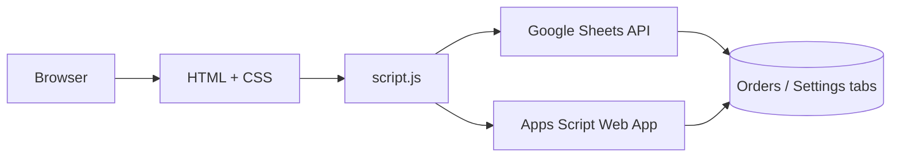
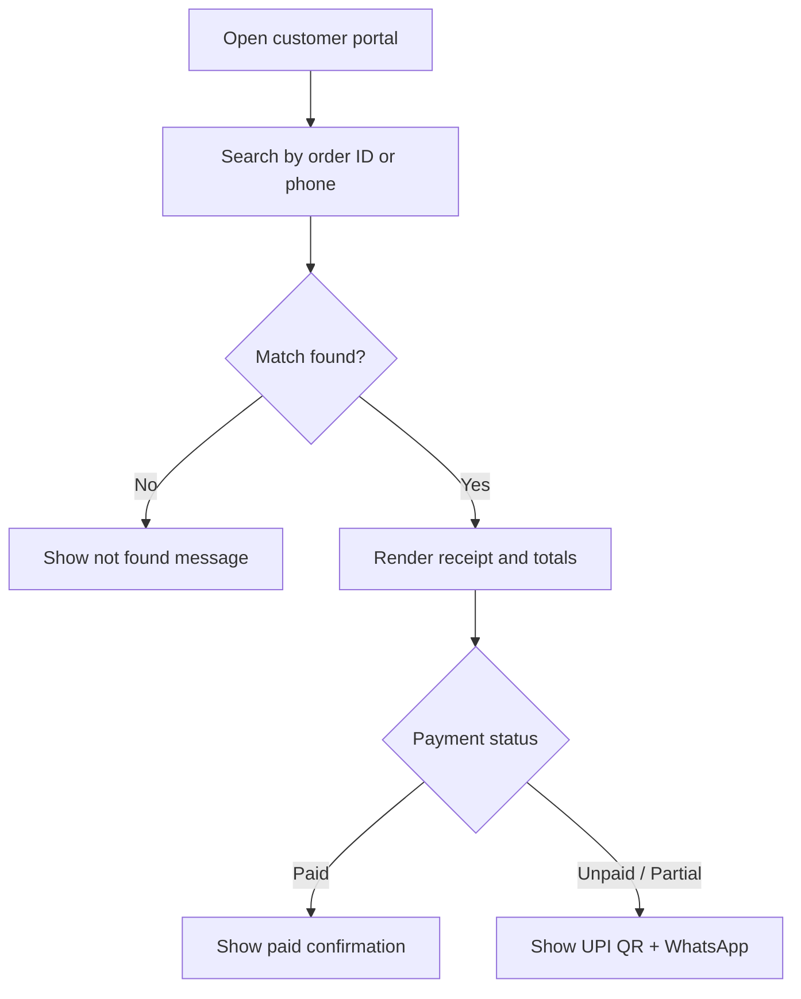
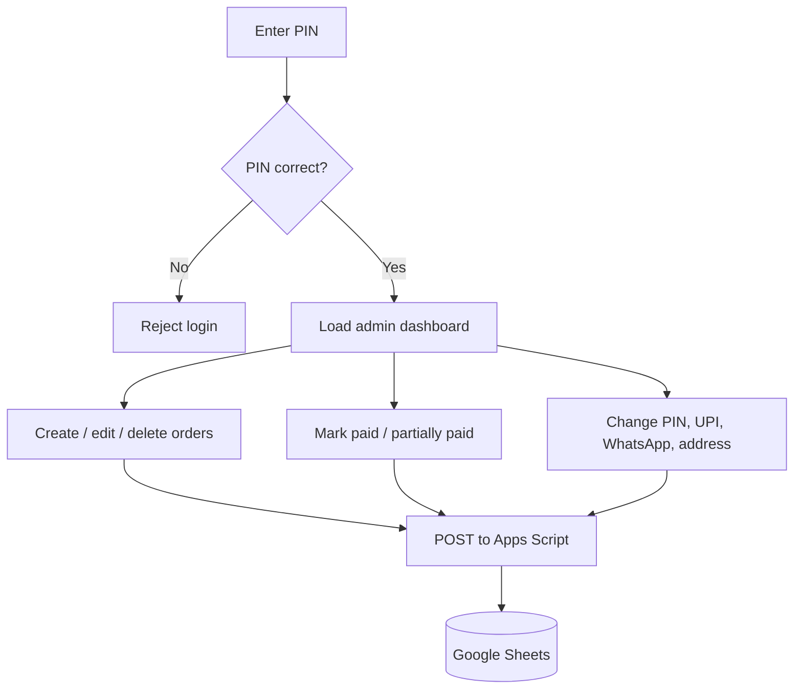

# Architecture Overview

This repo is split into a static front end, a read path through Google Sheets API, and a write path through Google Apps Script.

## Repository Layout

```text
.
├── admin.html              # Admin portal entry
├── customer.html           # Customer portal entry
├── index.html              # Home/landing page
├── track.html              # Redirect compatibility page
├── config.js               # Runtime settings and API placeholders
├── script.js               # Customer portal logic
├── style.css               # Customer portal styles
├── google-apps-script.gs   # Sheet write backend
├── docs/                   # Diagrams and architecture notes
├── js/
│   ├── admin.js            # Admin UI logic
│   └── sheets.js           # Admin sheet read/write helpers
└── styles/
  └── admin.css           # Admin portal styles
```

## Main Flow



## Customer Journey



## Admin Journey



## Sheet Schema

### Orders

| Column | Purpose |
| --- | --- |
| Order ID | Unique order reference |
| Customer Name | Customer display name |
| Phone | 10-digit contact number |
| Order Type | Garment/service type |
| Amount | Total bill amount |
| Paid Amount | Amount collected so far |
| Remaining | Balance left to collect |
| Payment Method | UPI / Cash / Partial / blank |
| Order Status | Ordered / In Progress / Completed / Delivered |
| Payment Status | Unpaid / Partially Paid / Paid |
| Order Date | Order creation date |
| Due Date | Target delivery date |
| Notes | Extra instructions |

### Settings

| Key | Purpose |
| --- | --- |
| PIN | Admin login PIN |
| UPI ID | Payment receiver ID |
| WhatsApp Number | Customer contact number |
| Shop Address | Displayed in portal and receipt |

## Write Actions

The Apps Script backend accepts these actions:

- `saveOrder`
- `updatePayment`
- `updateOrderStatus`
- `deleteOrder`
- `saveSettings`
- `resetData`

## Deployment Notes

- Keep `SHEET_ID`, `GOOGLE_API_KEY`, and `APPS_SCRIPT_URL` updated in [config.js](../config.js).
- `track.html` stays as a redirect for old links.
- The current setup is optimized for GitHub Pages + Google Sheets + Apps Script.